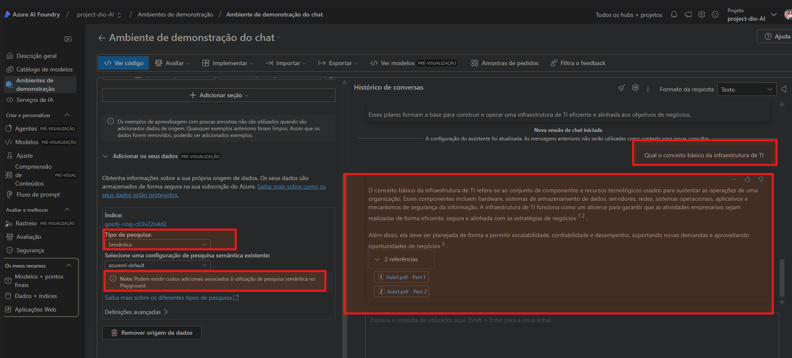
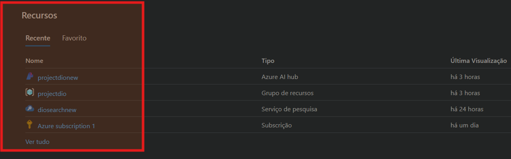

###Interação com a IA com estruturas do pdf:

- Utilizei um material que eu tinha armazenado da faculdade, tive retornos super legais da IA.
Faz um bom resumo e interage muito bem.

###Ambiente de Recursos:

- É bom prestar atenção e entender de fato como funciona o ambiente de recursos, é o local onde faz grande parte do Azure fazer sentido
(pelo menos pra mim).
